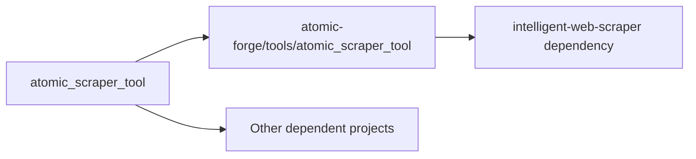

# 🔬 Development Pipeline for Multi-Repository Atomic Ecosystem

## 📋 Repository Structure

Our atomic ecosystem consists of multiple interconnected repositories:

```
atomic-ecosystem/
├── atomic-agents/                    # Core framework
│   └── atomic-forge/tools/          # Tool collection
├── atomic_scraper_tool/             # Standalone scraper tool (SOURCE OF TRUTH)
├── intelligent-web-scraper/         # Nuclear-powered platform
└── [other tools]/                   # Additional tools
```

## 🔄 Development Workflow

### 1. **Source of Truth Principle**
- **`atomic_scraper_tool/`** is the **primary development repository**
- All major features and improvements happen here first
- This ensures focused development and proper testing

### 2. **Backporting Pipeline**


### 3. **Update Process**

#### Phase 1: Development in Source Repository
```bash
cd atomic_scraper_tool/
# Develop features, fix bugs, add tests
git add .
git commit -m "feat: new feature"
git push origin main
```

#### Phase 2: Backport to Atomic-Forge
```bash
# Sync latest changes to atomic-forge
./scripts/sync-to-forge.sh
```

#### Phase 3: Update Dependent Projects
```bash
# Update intelligent-web-scraper dependencies
cd intelligent-web-scraper/
poetry update atomic-scraper-tool
```

## 🛠️ Automation Scripts

### Sync Script (`scripts/sync-to-forge.sh`)
```bash
#!/bin/bash
# Automated sync from atomic_scraper_tool to atomic-forge

SOURCE_DIR="atomic_scraper_tool"
TARGET_DIR="atomic-agents/atomic-forge/tools/atomic_scraper_tool"

echo "🔄 Syncing atomic_scraper_tool to atomic-forge..."

# Copy source files (excluding git and cache)
rsync -av --delete \
  --exclude='.git' \
  --exclude='__pycache__' \
  --exclude='.pytest_cache' \
  --exclude='*.egg-info' \
  --exclude='session_history_*.json' \
  --exclude='scraping_audit.log' \
  "$SOURCE_DIR/" "$TARGET_DIR/"

echo "✅ Sync complete!"
```

### Version Check Script (`scripts/check-versions.sh`)
```bash
#!/bin/bash
# Check version consistency across repositories

echo "📊 Version Status Report:"
echo "========================"

# Check atomic_scraper_tool version
SCRAPER_VERSION=$(grep 'version = ' atomic_scraper_tool/pyproject.toml | cut -d'"' -f2)
echo "🔧 atomic_scraper_tool: v$SCRAPER_VERSION"

# Check atomic-forge version
FORGE_VERSION=$(grep 'version = ' atomic-agents/atomic-forge/tools/atomic_scraper_tool/pyproject.toml | cut -d'"' -f2)
echo "⚛️  atomic-forge: v$FORGE_VERSION"

# Check intelligent-web-scraper dependency
IWS_DEP=$(grep 'atomic-scraper-tool' intelligent-web-scraper/pyproject.toml)
echo "🚀 intelligent-web-scraper: $IWS_DEP"

if [ "$SCRAPER_VERSION" != "$FORGE_VERSION" ]; then
    echo "⚠️  VERSION MISMATCH DETECTED!"
    echo "   Run: ./scripts/sync-to-forge.sh"
fi
```

## 🎯 Development Best Practices

### 1. **Feature Development**
- Always develop in `atomic_scraper_tool/` first
- Write comprehensive tests
- Update documentation
- Ensure backward compatibility

### 2. **Testing Strategy**
```bash
# Test in source repository
cd atomic_scraper_tool/
poetry run pytest

# Test in atomic-forge context
cd atomic-agents/atomic-forge/tools/atomic_scraper_tool/
poetry run pytest

# Test in intelligent-web-scraper
cd intelligent-web-scraper/
poetry run pytest
```

### 3. **Release Process**
1. **Development**: Feature complete in `atomic_scraper_tool/`
2. **Testing**: All tests pass in source repository
3. **Backport**: Sync to atomic-forge
4. **Integration**: Update dependent projects
5. **Validation**: End-to-end testing
6. **Release**: Tag versions and publish

## 🔍 Current Status Check

### Immediate Actions Needed:
1. ✅ **Sync atomic_scraper_tool to atomic-forge** (versions are out of sync)
2. ✅ **Update intelligent-web-scraper dependencies**
3. ✅ **Create automation scripts**
4. ✅ **Establish CI/CD pipeline**

### Version Status:
- `atomic_scraper_tool/`: v0.1.0 (5538de5) - **LATEST**
- `atomic-forge/`: v0.1.0 (b24be42) - **OUTDATED**
- `intelligent-web-scraper/`: Uses path dependency - **CURRENT**

## 🚀 Next Steps

1. **Immediate Sync**: Update atomic-forge with latest atomic_scraper_tool
2. **Create Scripts**: Implement automation scripts
3. **CI/CD Setup**: Automated testing and syncing
4. **Documentation**: Update all README files
5. **Release Management**: Version tagging strategy

## 🔧 Maintenance Commands

```bash
# Quick sync (manual)
./scripts/sync-to-forge.sh

# Version check
./scripts/check-versions.sh

# Full pipeline test
./scripts/test-pipeline.sh

# Release preparation
./scripts/prepare-release.sh
```

This pipeline ensures our nuclear-powered ecosystem stays synchronized and maintains reactor-grade quality! ⚛️