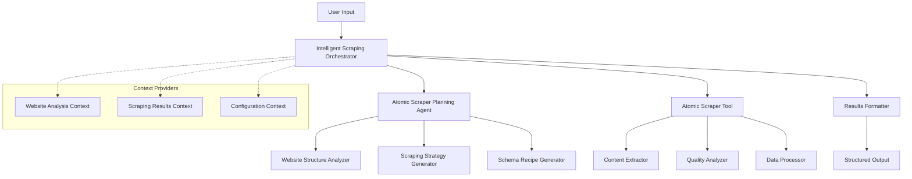

# Intelligent Web Scraper

An advanced example application for the [Atomic Agents](../atomic-agents) framework that demonstrates sophisticated AI-powered web scraping orchestration with intelligent strategy planning, real-time monitoring, and production-ready patterns.

## Overview

The Intelligent Web Scraper showcases how to build complex, multi-agent workflows using the Atomic Agents framework. It integrates our existing `atomic_scraper_tool` into the atomic-agents ecosystem, creating a comprehensive example that demonstrates:

- **Intelligent Agent Orchestration**: AI-powered coordination between multiple agents
- **Dynamic Strategy Planning**: Automatic analysis and strategy generation for different websites
- **Context Providers**: Dynamic context injection for enhanced agent capabilities
- **Real-time Monitoring**: Comprehensive monitoring of scraper instances and operations
- **Thread Management**: Proper concurrency control and resource management
- **Production Patterns**: Error handling, logging, configuration management, and scalability

## Architecture



## Features

### 🤖 Intelligent Orchestration
- Natural language scraping requests
- Automatic website analysis and strategy generation
- AI-powered decision making with reasoning explanations
- Confidence scoring for scraping approaches

### 🔧 Advanced Atomic Agents Patterns
- Proper BaseAgent integration with input/output schemas
- System prompt generation and context providers
- Schema alignment and data flow between components
- Tool factory and dependency injection patterns

### 📊 Real-time Monitoring
- Live monitoring dashboard with Rich console interface
- Instance lifecycle management and health monitoring
- Performance metrics and resource utilization tracking
- Alert system with visual notifications

### ⚡ Performance & Scalability
- Concurrent processing with thread pools and async coordination
- Intelligent resource allocation and load balancing
- Caching strategies for repeated operations
- Horizontal scaling patterns

### 🛡️ Production-Ready Features
- Comprehensive error handling and recovery mechanisms
- Structured logging with appropriate levels
- Configuration management with environment variables
- Rate limiting and compliance with robots.txt

## Prerequisites

- Python 3.11 or later
- [Atomic Agents](../atomic-agents) framework installed
- OpenAI API key (or other supported LLM provider)

## Installation

1. **Clone the repository** (if not already done):
   ```bash
   git clone <repository-url>
   cd atomic-agents/atomic-examples/intelligent-web-scraper
   ```

2. **Install dependencies**:
   ```bash
   poetry install
   ```

3. **Set up environment variables**:
   ```bash
   cp .env.example .env
   # Edit .env with your configuration
   ```

4. **Activate the environment**:
   ```bash
   poetry shell
   ```

## Quick Start

### Basic Usage

```python
from intelligent_web_scraper import IntelligentScrapingOrchestrator, IntelligentScrapingConfig

# Initialize the orchestrator
config = IntelligentScrapingConfig.from_env()
orchestrator = IntelligentScrapingOrchestrator(config=config)

# Define a scraping request
request = {
    "scraping_request": "Extract all product information from this e-commerce page",
    "target_url": "https://example-store.com/products",
    "max_results": 20,
    "quality_threshold": 70.0,
    "export_format": "json"
}

# Execute the scraping
result = await orchestrator.run(request)

print(f"Extracted {len(result.extracted_data)} items")
print(f"Quality Score: {result.quality_score}")
print(f"Reasoning: {result.reasoning}")
```

### Interactive Mode

```python
from intelligent_web_scraper.main import main

# Run the interactive interface
if __name__ == "__main__":
    main()
```

### Advanced Configuration

```python
from intelligent_web_scraper import IntelligentScrapingConfig

config = IntelligentScrapingConfig(
    orchestrator_model="gpt-4",
    planning_agent_model="gpt-4",
    max_concurrent_requests=10,
    enable_monitoring=True,
    max_instances=8,
    quality_threshold=80.0,
    results_directory="./custom_results"
)

orchestrator = IntelligentScrapingOrchestrator(config=config)
```

## Configuration

### Environment Variables

Create a `.env` file with the following variables:

```bash
# LLM Configuration
OPENAI_API_KEY=your_openai_api_key_here
ORCHESTRATOR_MODEL=gpt-4o-mini
PLANNING_AGENT_MODEL=gpt-4o-mini

# Scraping Configuration
QUALITY_THRESHOLD=50.0
MAX_CONCURRENT_REQUESTS=5
REQUEST_DELAY=1.0
RESPECT_ROBOTS_TXT=true
ENABLE_RATE_LIMITING=true

# Output Configuration
EXPORT_FORMAT=json
RESULTS_DIRECTORY=./results

# Monitoring Configuration
ENABLE_MONITORING=true
MONITORING_INTERVAL=1.0

# Concurrency Configuration
MAX_INSTANCES=5
MAX_WORKERS=10
MAX_ASYNC_TASKS=50
```

### Configuration Options

| Option | Type | Default | Description |
|--------|------|---------|-------------|
| `orchestrator_model` | str | "gpt-4o-mini" | Model for orchestrator agent |
| `planning_agent_model` | str | "gpt-4o-mini" | Model for planning agent |
| `default_quality_threshold` | float | 50.0 | Minimum quality score for results |
| `max_concurrent_requests` | int | 5 | Maximum concurrent HTTP requests |
| `request_delay` | float | 1.0 | Delay between requests (seconds) |
| `enable_monitoring` | bool | true | Enable real-time monitoring |
| `max_instances` | int | 5 | Maximum scraper instances |

## Usage Examples

### Example 1: E-commerce Product Scraping

```python
request = {
    "scraping_request": "Extract product names, prices, ratings, and availability from this product listing page",
    "target_url": "https://example-store.com/category/electronics",
    "max_results": 50,
    "quality_threshold": 75.0,
    "export_format": "csv"
}

result = await orchestrator.run(request)
```

### Example 2: News Article Extraction

```python
request = {
    "scraping_request": "Extract article titles, authors, publication dates, and full content from this news website",
    "target_url": "https://example-news.com/technology",
    "max_results": 25,
    "quality_threshold": 80.0,
    "export_format": "markdown"
}

result = await orchestrator.run(request)
```

### Example 3: Directory Listing Scraping

```python
request = {
    "scraping_request": "Extract business names, addresses, phone numbers, and categories from this directory",
    "target_url": "https://example-directory.com/restaurants/new-york",
    "max_results": 100,
    "quality_threshold": 60.0,
    "export_format": "json",
    "concurrent_instances": 3
}

result = await orchestrator.run(request)
```

## Monitoring and Performance

### Real-time Dashboard

The system includes a comprehensive monitoring dashboard that displays:

- **Instance Status**: Real-time status of all scraper instances
- **Performance Metrics**: Throughput, success rates, response times
- **Resource Utilization**: Memory, CPU, and network usage
- **Alerts and Recommendations**: Automated system optimization suggestions

### Metrics Collection

```python
# Access monitoring report
monitoring_report = await orchestrator.get_monitoring_report()

print(f"Active Instances: {monitoring_report.active_instances}")
print(f"Overall Throughput: {monitoring_report.overall_throughput} req/sec")
print(f"Success Rate: {monitoring_report.overall_success_rate:.1%}")
```

## Advanced Features

### Context Providers

The system demonstrates advanced context provider patterns:

```python
from intelligent_web_scraper.context_providers import (
    WebsiteAnalysisContextProvider,
    ScrapingResultsContextProvider,
    ConfigurationContextProvider
)

# Custom context provider usage
website_context = WebsiteAnalysisContextProvider()
website_context.set_analysis_results(analysis_data)

orchestrator.add_context_provider(website_context)
```

### Custom Tool Integration

```python
from intelligent_web_scraper.tools import ToolFactory

# Create custom tool factory
tool_factory = ToolFactory(config=config)
custom_scraper = tool_factory.create_scraper_tool(
    tool_type="advanced_scraper",
    custom_config=custom_scraper_config
)

orchestrator.register_tool(custom_scraper)
```

## Testing

Run the test suite:

```bash
# Run all tests
poetry run pytest

# Run with coverage
poetry run pytest --cov=intelligent_web_scraper

# Run specific test categories
poetry run pytest tests/unit/
poetry run pytest tests/integration/
poetry run pytest tests/e2e/
```

## Development

### Project Structure

```
intelligent-web-scraper/
├── intelligent_web_scraper/
│   ├── __init__.py
│   ├── config.py
│   ├── main.py
│   ├── agents/
│   │   ├── __init__.py
│   │   └── orchestrator.py
│   ├── context_providers/
│   │   ├── __init__.py
│   │   ├── website_analysis.py
│   │   ├── scraping_results.py
│   │   └── configuration.py
│   └── tools/
│       ├── __init__.py
│       └── tool_factory.py
├── tests/
│   ├── unit/
│   ├── integration/
│   └── e2e/
├── examples/
├── docs/
├── pyproject.toml
├── README.md
└── .env.example
```

### Contributing

1. Fork the repository
2. Create a feature branch: `git checkout -b feature/amazing-feature`
3. Make your changes and add tests
4. Run the test suite: `poetry run pytest`
5. Format code: `poetry run black . && poetry run isort .`
6. Commit changes: `git commit -m 'Add amazing feature'`
7. Push to branch: `git push origin feature/amazing-feature`
8. Open a Pull Request

## Educational Value

This example demonstrates several advanced Atomic Agents concepts:

### 1. Agent Orchestration Patterns
- How to coordinate multiple agents in complex workflows
- Schema alignment and data flow between components
- Error handling and graceful degradation

### 2. Context Provider Implementation
- Dynamic context injection for enhanced agent capabilities
- Context caching and invalidation strategies
- Multi-source context aggregation

### 3. Production-Ready Patterns
- Configuration management and environment handling
- Structured logging and monitoring
- Resource management and cleanup
- Thread safety and concurrency control

### 4. Tool Integration
- Sophisticated tool integration with atomic-agents
- Tool factory and dependency injection patterns
- Custom tool development and registration

## Troubleshooting

### Common Issues

**Issue**: "Module not found" errors
**Solution**: Ensure you're in the poetry environment: `poetry shell`

**Issue**: API rate limiting
**Solution**: Adjust `request_delay` and `max_concurrent_requests` in configuration

**Issue**: Memory usage high
**Solution**: Reduce `max_instances` and `max_async_tasks` values

**Issue**: Monitoring dashboard not updating
**Solution**: Check `enable_monitoring` is true and `monitoring_interval` is appropriate

### Debug Mode

Enable debug logging:

```python
import logging
logging.basicConfig(level=logging.DEBUG)

config = IntelligentScrapingConfig(enable_monitoring=True)
orchestrator = IntelligentScrapingOrchestrator(config=config)
```

## License

This project is licensed under the same license as the main Atomic Agents project. See the [LICENSE](../../LICENSE) file for details.

## Support

For questions, issues, or contributions:

1. Check the [documentation](docs/)
2. Search existing [issues](../../issues)
3. Create a new issue with detailed information
4. Join the community discussions

---

**Note**: This is an educational example demonstrating advanced Atomic Agents patterns. For production use, consider additional security, monitoring, and compliance requirements specific to your use case.