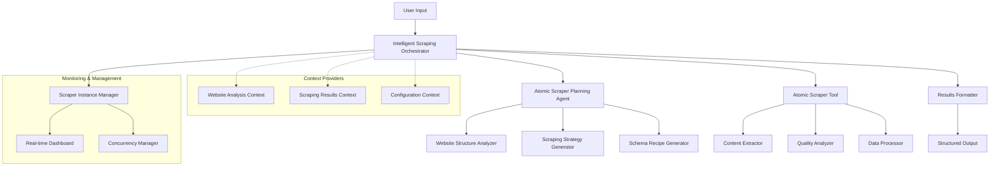
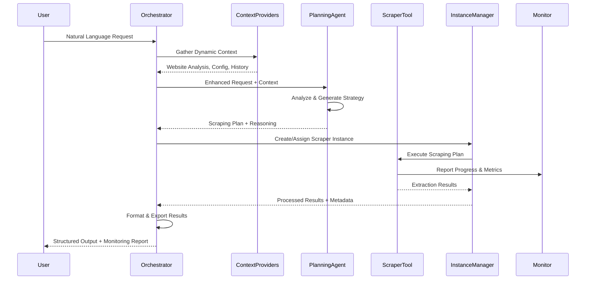

# Intelligent Web Scraper

An advanced example application for the [Atomic Agents](../atomic-agents) framework that demonstrates sophisticated AI-powered web scraping orchestration with intelligent strategy planning, real-time monitoring, and production-ready patterns.

This project serves as both a practical scraping solution and a comprehensive educational example showcasing how to build complex, multi-agent workflows using the Atomic Agents framework.

## Overview

The Intelligent Web Scraper showcases how to build complex, multi-agent workflows using the Atomic Agents framework. It integrates our existing `atomic_scraper_tool` into the atomic-agents ecosystem, creating a comprehensive solution that demonstrates:

- **🤖 Intelligent Agent Orchestration**: AI-powered coordination between multiple agents with natural language understanding
- **🧠 Dynamic Strategy Planning**: Automatic website analysis and strategy generation with reasoning explanations
- **🔄 Context Providers**: Dynamic context injection for enhanced agent capabilities and decision making
- **📊 Real-time Monitoring**: Comprehensive monitoring of scraper instances with live dashboards and alerts
- **⚡ Thread Management**: Proper concurrency control, resource management, and async coordination
- **🛡️ Production Patterns**: Error handling, structured logging, configuration management, and horizontal scalability

### Key Learning Objectives

This example is designed to teach developers:

1. **Advanced Agent Patterns**: How to build sophisticated multi-agent systems with proper coordination
2. **Tool Integration**: Best practices for integrating complex tools into the Atomic Agents ecosystem
3. **Context Management**: Dynamic context injection and provider patterns for enhanced agent capabilities
4. **Production Readiness**: Implementing monitoring, error handling, and scalability patterns
5. **Concurrency Control**: Thread-safe operations and async coordination in agent systems

## Architecture

### High-Level System Architecture



### Component Architecture Details

#### 1. Intelligent Scraping Orchestrator
The main coordination agent that:
- Processes natural language scraping requests
- Coordinates between planning agent and scraper tool
- Manages context providers and dynamic context injection
- Handles schema transformation and data flow
- Provides monitoring and instance management

#### 2. Atomic Scraper Planning Agent
AI-powered planning component that:
- Analyzes website structure and content patterns
- Generates optimal scraping strategies with reasoning
- Creates extraction schemas and validation rules
- Provides confidence scoring for different approaches

#### 3. Atomic Scraper Tool Integration
Sophisticated scraping execution engine that:
- Executes planned scraping strategies
- Performs content extraction with quality analysis
- Handles error recovery and retry logic
- Manages rate limiting and compliance

#### 4. Context Provider System
Dynamic context injection framework featuring:
- **Website Analysis Context**: Real-time website structure analysis
- **Scraping Results Context**: Historical results and patterns
- **Configuration Context**: Environment and system configuration

#### 5. Monitoring & Instance Management
Production-ready monitoring system with:
- Real-time instance lifecycle management
- Performance metrics and resource utilization tracking
- Thread-safe concurrent operation management
- Alert system with automated recommendations

### Data Flow Architecture



## Features

### 🤖 Intelligent Orchestration
- Natural language scraping requests
- Automatic website analysis and strategy generation
- AI-powered decision making with reasoning explanations
- Confidence scoring for scraping approaches

### 🔧 Advanced Atomic Agents Patterns
- Proper BaseAgent integration with input/output schemas
- System prompt generation and context providers
- Schema alignment and data flow between components
- Tool factory and dependency injection patterns

### 📊 Real-time Monitoring
- Live monitoring dashboard with Rich console interface
- Instance lifecycle management and health monitoring
- Performance metrics and resource utilization tracking
- Alert system with visual notifications

### ⚡ Performance & Scalability
- Concurrent processing with thread pools and async coordination
- Intelligent resource allocation and load balancing
- Caching strategies for repeated operations
- Horizontal scaling patterns

### 🛡️ Production-Ready Features
- Comprehensive error handling and recovery mechanisms
- Structured logging with appropriate levels
- Configuration management with environment variables
- Rate limiting and compliance with robots.txt

## Prerequisites

### System Requirements
- **Python**: 3.11 or later (3.12 recommended for optimal performance)
- **Memory**: Minimum 4GB RAM (8GB recommended for concurrent operations)
- **Storage**: At least 1GB free space for dependencies and results
- **Network**: Stable internet connection for LLM API calls and web scraping

### Dependencies
- **[Atomic Agents](../atomic-agents)**: Core framework (automatically installed)
- **atomic_scraper_tool**: Integrated scraping engine (included as dependency)
- **OpenAI API**: For LLM capabilities (or other supported providers)
- **Poetry**: For dependency management and virtual environment

### Supported LLM Providers
- OpenAI (GPT-4, GPT-4o-mini, GPT-3.5-turbo)
- Anthropic Claude (via atomic-agents)
- Azure OpenAI
- Local models via Ollama (experimental)

## Installation

### Method 1: Standard Installation (Recommended)

1. **Clone the repository** (if not already done):
   ```bash
   git clone <repository-url>
   cd atomic-agents/atomic-examples/intelligent-web-scraper
   ```

2. **Verify Poetry installation**:
   ```bash
   poetry --version
   # If not installed: curl -sSL https://install.python-poetry.org | python3 -
   ```

3. **Install dependencies**:
   ```bash
   # Install all dependencies including dev tools
   poetry install
   
   # For production use only (smaller footprint):
   poetry install --only=main
   ```

4. **Set up environment variables**:
   ```bash
   # Copy the example environment file
   cp .env.example .env
   
   # Edit with your preferred editor
   nano .env  # or vim .env, code .env, etc.
   ```

5. **Configure your API keys** in `.env`:
   ```bash
   # Required: OpenAI API key
   OPENAI_API_KEY=sk-your-openai-api-key-here
   
   # Optional: Other provider keys
   ANTHROPIC_API_KEY=your-anthropic-key-here
   AZURE_OPENAI_API_KEY=your-azure-key-here
   ```

6. **Activate the environment**:
   ```bash
   poetry shell
   ```

7. **Verify installation**:
   ```bash
   # Test basic functionality
   python -c "from intelligent_web_scraper import IntelligentScrapingOrchestrator; print('Installation successful!')"
   
   # Run a simple test
   python -m pytest tests/test_basic_setup.py -v
   ```

### Method 2: Development Installation

For contributors and developers who want to modify the code:

1. **Follow steps 1-6 from Method 1**

2. **Install development dependencies**:
   ```bash
   poetry install --with dev,test,docs
   ```

3. **Set up pre-commit hooks** (optional but recommended):
   ```bash
   poetry run pre-commit install
   ```

4. **Run the full test suite**:
   ```bash
   poetry run pytest --cov=intelligent_web_scraper
   ```

### Method 3: Docker Installation (Coming Soon)

```bash
# Build the Docker image
docker build -t intelligent-web-scraper .

# Run with environment variables
docker run -e OPENAI_API_KEY=your-key-here intelligent-web-scraper
```

### Dependency Management

The project uses Poetry for dependency management. Key dependencies include:

```toml
[tool.poetry.dependencies]
python = "^3.11"
atomic-agents = "^0.1.0"
atomic-scraper-tool = "^1.0.0"
rich = "^13.0.0"
aiohttp = "^3.9.0"
pydantic = "^2.5.0"
```

### Troubleshooting Installation

**Issue**: Poetry not found
```bash
# Install Poetry
curl -sSL https://install.python-poetry.org | python3 -
# Add to PATH: export PATH="$HOME/.local/bin:$PATH"
```

**Issue**: Python version mismatch
```bash
# Check Python version
python --version
# Install Python 3.11+ using pyenv, conda, or system package manager
```

**Issue**: Dependency conflicts
```bash
# Clear Poetry cache and reinstall
poetry cache clear pypi --all
poetry install --no-cache
```

**Issue**: Permission errors
```bash
# Ensure proper permissions
chmod +x scripts/*
# Or run with appropriate permissions
```

## Quick Start

### Basic Usage

```python
from intelligent_web_scraper import IntelligentScrapingOrchestrator, IntelligentScrapingConfig

# Initialize the orchestrator
config = IntelligentScrapingConfig.from_env()
orchestrator = IntelligentScrapingOrchestrator(config=config)

# Define a scraping request
request = {
    "scraping_request": "Extract all product information from this e-commerce page",
    "target_url": "https://example-store.com/products",
    "max_results": 20,
    "quality_threshold": 70.0,
    "export_format": "json"
}

# Execute the scraping
result = await orchestrator.run(request)

print(f"Extracted {len(result.extracted_data)} items")
print(f"Quality Score: {result.quality_score}")
print(f"Reasoning: {result.reasoning}")
```

### Interactive Mode

```python
from intelligent_web_scraper.main import main

# Run the interactive interface
if __name__ == "__main__":
    main()
```

### Advanced Configuration

```python
from intelligent_web_scraper import IntelligentScrapingConfig

config = IntelligentScrapingConfig(
    orchestrator_model="gpt-4",
    planning_agent_model="gpt-4",
    max_concurrent_requests=10,
    enable_monitoring=True,
    max_instances=8,
    quality_threshold=80.0,
    results_directory="./custom_results"
)

orchestrator = IntelligentScrapingOrchestrator(config=config)
```

## Configuration

### Environment Variables

Create a `.env` file with the following variables:

```bash
# LLM Configuration
OPENAI_API_KEY=your_openai_api_key_here
ORCHESTRATOR_MODEL=gpt-4o-mini
PLANNING_AGENT_MODEL=gpt-4o-mini

# Scraping Configuration
QUALITY_THRESHOLD=50.0
MAX_CONCURRENT_REQUESTS=5
REQUEST_DELAY=1.0
RESPECT_ROBOTS_TXT=true
ENABLE_RATE_LIMITING=true

# Output Configuration
EXPORT_FORMAT=json
RESULTS_DIRECTORY=./results

# Monitoring Configuration
ENABLE_MONITORING=true
MONITORING_INTERVAL=1.0

# Concurrency Configuration
MAX_INSTANCES=5
MAX_WORKERS=10
MAX_ASYNC_TASKS=50
```

### Configuration Options

| Option | Type | Default | Description |
|--------|------|---------|-------------|
| `orchestrator_model` | str | "gpt-4o-mini" | Model for orchestrator agent |
| `planning_agent_model` | str | "gpt-4o-mini" | Model for planning agent |
| `default_quality_threshold` | float | 50.0 | Minimum quality score for results |
| `max_concurrent_requests` | int | 5 | Maximum concurrent HTTP requests |
| `request_delay` | float | 1.0 | Delay between requests (seconds) |
| `enable_monitoring` | bool | true | Enable real-time monitoring |
| `max_instances` | int | 5 | Maximum scraper instances |

## Usage Examples

### Example 1: E-commerce Product Scraping

```python
request = {
    "scraping_request": "Extract product names, prices, ratings, and availability from this product listing page",
    "target_url": "https://example-store.com/category/electronics",
    "max_results": 50,
    "quality_threshold": 75.0,
    "export_format": "csv"
}

result = await orchestrator.run(request)
```

### Example 2: News Article Extraction

```python
request = {
    "scraping_request": "Extract article titles, authors, publication dates, and full content from this news website",
    "target_url": "https://example-news.com/technology",
    "max_results": 25,
    "quality_threshold": 80.0,
    "export_format": "markdown"
}

result = await orchestrator.run(request)
```

### Example 3: Directory Listing Scraping

```python
request = {
    "scraping_request": "Extract business names, addresses, phone numbers, and categories from this directory",
    "target_url": "https://example-directory.com/restaurants/new-york",
    "max_results": 100,
    "quality_threshold": 60.0,
    "export_format": "json",
    "concurrent_instances": 3
}

result = await orchestrator.run(request)
```

## Monitoring and Performance

### Real-time Dashboard

The system includes a comprehensive monitoring dashboard that displays:

- **Instance Status**: Real-time status of all scraper instances
- **Performance Metrics**: Throughput, success rates, response times
- **Resource Utilization**: Memory, CPU, and network usage
- **Alerts and Recommendations**: Automated system optimization suggestions

### Metrics Collection

```python
# Access monitoring report
monitoring_report = await orchestrator.get_monitoring_report()

print(f"Active Instances: {monitoring_report.active_instances}")
print(f"Overall Throughput: {monitoring_report.overall_throughput} req/sec")
print(f"Success Rate: {monitoring_report.overall_success_rate:.1%}")
```

## Advanced Features

### Context Providers

The system demonstrates advanced context provider patterns:

```python
from intelligent_web_scraper.context_providers import (
    WebsiteAnalysisContextProvider,
    ScrapingResultsContextProvider,
    ConfigurationContextProvider
)

# Custom context provider usage
website_context = WebsiteAnalysisContextProvider()
website_context.set_analysis_results(analysis_data)

orchestrator.add_context_provider(website_context)
```

### Custom Tool Integration

```python
from intelligent_web_scraper.tools import ToolFactory

# Create custom tool factory
tool_factory = ToolFactory(config=config)
custom_scraper = tool_factory.create_scraper_tool(
    tool_type="advanced_scraper",
    custom_config=custom_scraper_config
)

orchestrator.register_tool(custom_scraper)
```

## Testing

Run the test suite:

```bash
# Run all tests
poetry run pytest

# Run with coverage
poetry run pytest --cov=intelligent_web_scraper

# Run specific test categories
poetry run pytest tests/unit/
poetry run pytest tests/integration/
poetry run pytest tests/e2e/
```

## Development

### Project Structure

```
intelligent-web-scraper/
├── intelligent_web_scraper/
│   ├── __init__.py
│   ├── config.py
│   ├── main.py
│   ├── agents/
│   │   ├── __init__.py
│   │   └── orchestrator.py
│   ├── context_providers/
│   │   ├── __init__.py
│   │   ├── website_analysis.py
│   │   ├── scraping_results.py
│   │   └── configuration.py
│   └── tools/
│       ├── __init__.py
│       └── tool_factory.py
├── tests/
│   ├── unit/
│   ├── integration/
│   └── e2e/
├── examples/
├── docs/
├── pyproject.toml
├── README.md
└── .env.example
```

### Contributing

1. Fork the repository
2. Create a feature branch: `git checkout -b feature/amazing-feature`
3. Make your changes and add tests
4. Run the test suite: `poetry run pytest`
5. Format code: `poetry run black . && poetry run isort .`
6. Commit changes: `git commit -m 'Add amazing feature'`
7. Push to branch: `git push origin feature/amazing-feature`
8. Open a Pull Request

## Educational Value

This example demonstrates several advanced Atomic Agents concepts:

### 1. Agent Orchestration Patterns
- How to coordinate multiple agents in complex workflows
- Schema alignment and data flow between components
- Error handling and graceful degradation

### 2. Context Provider Implementation
- Dynamic context injection for enhanced agent capabilities
- Context caching and invalidation strategies
- Multi-source context aggregation

### 3. Production-Ready Patterns
- Configuration management and environment handling
- Structured logging and monitoring
- Resource management and cleanup
- Thread safety and concurrency control

### 4. Tool Integration
- Sophisticated tool integration with atomic-agents
- Tool factory and dependency injection patterns
- Custom tool development and registration

## Troubleshooting

### Common Issues and Solutions

#### Installation and Setup Issues

**Issue**: "Module not found" errors
```bash
# Solution: Ensure you're in the poetry environment
poetry shell
# Verify installation
poetry show intelligent-web-scraper
```

**Issue**: Poetry installation fails
```bash
# Solution: Clear cache and reinstall
poetry cache clear pypi --all
rm poetry.lock
poetry install
```

**Issue**: Python version compatibility
```bash
# Solution: Check and upgrade Python version
python --version  # Should be 3.11+
# Use pyenv to manage Python versions
pyenv install 3.12.0
pyenv local 3.12.0
```

#### Runtime Issues

**Issue**: API rate limiting errors
```bash
# Solution: Adjust rate limiting in .env
REQUEST_DELAY=2.0
MAX_CONCURRENT_REQUESTS=3
ENABLE_RATE_LIMITING=true
```

**Issue**: Memory usage too high
```bash
# Solution: Reduce concurrent operations
MAX_INSTANCES=3
MAX_WORKERS=5
MAX_ASYNC_TASKS=25
```

**Issue**: Monitoring dashboard not updating
```bash
# Solution: Check monitoring configuration
ENABLE_MONITORING=true
MONITORING_INTERVAL=1.0
# Ensure Rich console is properly initialized
```

**Issue**: Scraping fails with timeout errors
```bash
# Solution: Increase timeout values
HTTP_TIMEOUT=30
SCRAPING_TIMEOUT=60
# Check network connectivity
```

#### Configuration Issues

**Issue**: Environment variables not loaded
```bash
# Solution: Verify .env file location and format
ls -la .env
cat .env | grep -v "^#" | grep -v "^$"
# Ensure no spaces around = in .env
```

**Issue**: Invalid API keys
```bash
# Solution: Verify API key format and permissions
# OpenAI keys start with 'sk-'
# Test API key manually:
curl -H "Authorization: Bearer $OPENAI_API_KEY" \
     https://api.openai.com/v1/models
```

#### Performance Issues

**Issue**: Slow scraping performance
```bash
# Solution: Optimize configuration
MAX_CONCURRENT_REQUESTS=8
ENABLE_CACHING=true
CACHE_TTL=3600
# Use faster models for planning
PLANNING_AGENT_MODEL=gpt-4o-mini
```

**Issue**: High CPU usage
```bash
# Solution: Reduce thread pool size
MAX_WORKERS=4
# Use async operations where possible
PREFER_ASYNC=true
```

#### Scraping-Specific Issues

**Issue**: Low quality scores
```bash
# Solution: Adjust quality threshold and improve prompts
QUALITY_THRESHOLD=40.0
# Use more sophisticated models
ORCHESTRATOR_MODEL=gpt-4
```

**Issue**: Blocked by websites
```bash
# Solution: Respect robots.txt and add delays
RESPECT_ROBOTS_TXT=true
REQUEST_DELAY=3.0
USER_AGENT="Mozilla/5.0 (compatible; IntelligentScraper/1.0)"
```

**Issue**: Export failures
```bash
# Solution: Check export directory permissions
mkdir -p ./results
chmod 755 ./results
# Verify export format
EXPORT_FORMAT=json  # or csv, markdown, excel
```

### Debug Mode and Logging

#### Enable Debug Logging

```python
import logging
import sys

# Configure detailed logging
logging.basicConfig(
    level=logging.DEBUG,
    format='%(asctime)s - %(name)s - %(levelname)s - %(message)s',
    handlers=[
        logging.StreamHandler(sys.stdout),
        logging.FileHandler('debug.log')
    ]
)

# Enable specific component logging
logging.getLogger('intelligent_web_scraper').setLevel(logging.DEBUG)
logging.getLogger('atomic_scraper_tool').setLevel(logging.DEBUG)
```

#### Environment-Specific Debug Settings

```bash
# Development environment
DEBUG=true
LOG_LEVEL=DEBUG
ENABLE_VERBOSE_LOGGING=true

# Production environment
DEBUG=false
LOG_LEVEL=INFO
ENABLE_PERFORMANCE_LOGGING=true
```

#### Monitoring and Diagnostics

```python
# Enable comprehensive monitoring
config = IntelligentScrapingConfig(
    enable_monitoring=True,
    monitoring_interval=0.5,
    enable_performance_logging=True,
    enable_resource_tracking=True
)

# Access diagnostic information
orchestrator = IntelligentScrapingOrchestrator(config=config)
diagnostics = await orchestrator.get_system_diagnostics()
print(f"System Health: {diagnostics.overall_health}")
print(f"Active Instances: {diagnostics.active_instances}")
print(f"Memory Usage: {diagnostics.memory_usage_mb} MB")
```

### Performance Optimization

#### Memory Optimization

```bash
# Reduce memory footprint
MAX_INSTANCES=2
MAX_ASYNC_TASKS=10
ENABLE_RESULT_STREAMING=true
CLEANUP_INTERVAL=300  # seconds
```

#### Network Optimization

```bash
# Optimize network usage
CONNECTION_POOL_SIZE=10
KEEP_ALIVE_TIMEOUT=30
DNS_CACHE_TTL=300
ENABLE_COMPRESSION=true
```

#### Concurrent Processing Optimization

```python
# Fine-tune concurrency settings
config = IntelligentScrapingConfig(
    max_concurrent_requests=min(8, os.cpu_count()),
    max_workers=min(10, os.cpu_count() * 2),
    max_async_tasks=50,
    enable_load_balancing=True
)
```

### Getting Help

#### Self-Diagnosis Tools

```bash
# Run system diagnostics
python -m intelligent_web_scraper.diagnostics

# Test configuration
python -m intelligent_web_scraper.config --test

# Validate environment
python -m intelligent_web_scraper.validate_env
```

#### Log Analysis

```bash
# Analyze error patterns
grep -i error logs/scraper.log | tail -20

# Check performance metrics
grep -i "processing_time" logs/scraper.log | awk '{print $NF}' | sort -n
```

#### Community Support

1. **Check Documentation**: Review the [docs/](docs/) directory
2. **Search Issues**: Look through existing [GitHub issues](../../issues)
3. **Create Detailed Issue**: Include:
   - Python version and OS
   - Complete error messages
   - Configuration (sanitized)
   - Steps to reproduce
   - Expected vs actual behavior

#### Professional Support

For production deployments or complex issues:
- Review the [Enterprise Support](docs/enterprise-support.md) options
- Consider [Professional Services](docs/professional-services.md) for custom implementations

## License

This project is licensed under the same license as the main Atomic Agents project. See the [LICENSE](../../LICENSE) file for details.

## Support

For questions, issues, or contributions:

1. Check the [documentation](docs/)
2. Search existing [issues](../../issues)
3. Create a new issue with detailed information
4. Join the community discussions

---

**Note**: This is an educational example demonstrating advanced Atomic Agents patterns. For production use, consider additional security, monitoring, and compliance requirements specific to your use case.